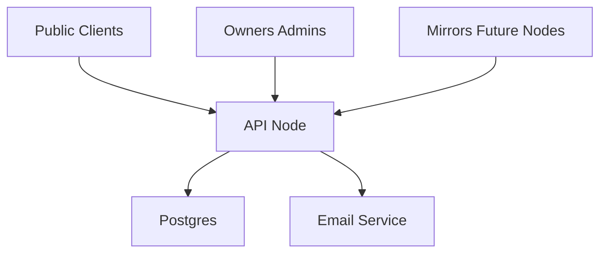

# OpenChip Threat Model

## Executive summary

The highest-risk failure mode for OpenChip is trust concentration: a single operator controlling mutable registry state and private owner contact data without durable export or independent verification. The phase 1 reference-node design reduces that risk by separating private contact data, adding append-only event history, and defining public export surfaces for mirrors and future federation.

## Scope and assumptions

In scope:

- API server, database schema, and local operator workflows
- public lookup, shelter flow, dispute flow, and export surfaces
- federation-ready event and snapshot interfaces

Assumptions:

- phase 1 remains a single-node deployment per operator
- nodes are internet exposed
- public lookups must not reveal owner PII
- no cross-node auth or signature verification is enforced yet

## System model

### Primary components

- Public clients use HTTP endpoints for lookup, node metadata, snapshots, and event exports.
- Owner and admin clients use node-local auth and management flows.
- The API writes local projections and append-only ownership events into PostgreSQL.
- Email remains a mediated recovery mechanism, not a public data surface.

### Data flows and trust boundaries

- Internet -> Public lookup API: chip identifiers and contact requests cross an untrusted boundary over HTTP; rate limiting and validation are present.
- Owner client -> Auth/session API: email-based sign-in and node-local JWT sessions cross a user-to-node boundary.
- Operator/admin -> Dispute workflow: privileged state transitions cross an operator boundary.
- API -> PostgreSQL: integrity-critical state and private contact data cross the application/data boundary.
- External mirrors -> Snapshot/event export endpoints: public protocol data crosses a federation boundary.

## Assets and security objectives

| Asset | Why it matters | Security objective |
| --- | --- | --- |
| Owner contact data | Exposure can harm owners and pets | C |
| Registration and dispute history | Must remain trustworthy across operator changes | I |
| Public snapshot exports | Must be mirrorable without leaking private data | I/C |
| Event stream | Must support auditability and future verification | I |
| Node metadata and key metadata | Future federation depends on trusted publication | I |
| Availability of lookup and contact mediation | Useful recovery workflows depend on uptime | A |

## Attacker model

### Capabilities

- Anonymous internet users can hit public lookup and export endpoints.
- Authenticated owners can manage their own records.
- API-key clients can invoke sheltered recovery workflows.
- Operators can make privileged dispute decisions.

### Non-capabilities

- Phase 1 does not assume Byzantine multi-node replication.
- Attackers are not assumed to have arbitrary database write access.

## Top abuse paths

1. Scrape public lookup endpoints to harvest owner PII if contact data is accidentally exposed.
2. Rewrite mutable ownership state without preserving history, hiding operator abuse or mistakes.
3. Export malformed or incomplete snapshots that make mirroring unreliable.
4. Forge future federation history if event signing and key publication are undefined.
5. Abuse shelter or AAHA compatibility endpoints to obtain direct owner contact data.
6. Use dispute resolution to silently replace claims without a visible audit trail.

## Phase 1 mitigations

- Public lookup keeps mediated contact only.
- Shelter and AAHA compatibility responses no longer expose raw owner email/phone.
- Private contact data is split into `owner_contacts`.
- Important state changes are appended to `ownership_events`.
- Snapshot and event-stream exports establish mirrorable public surfaces.

## Residual risks

- Legacy owner contact duplication still exists in the `owners` table during migration.
- JWT auth is still node-local and centralized.
- Signatures are modeled but not enforced yet.
- The event log is written alongside legacy projections rather than being the sole source of truth.

## Priority follow-up controls

1. Remove legacy contact duplication from `owners`.
2. Add operator signing keys and signature verification for exported events.
3. Rebuild projections from the event log and claims model instead of directly mutating business tables.
