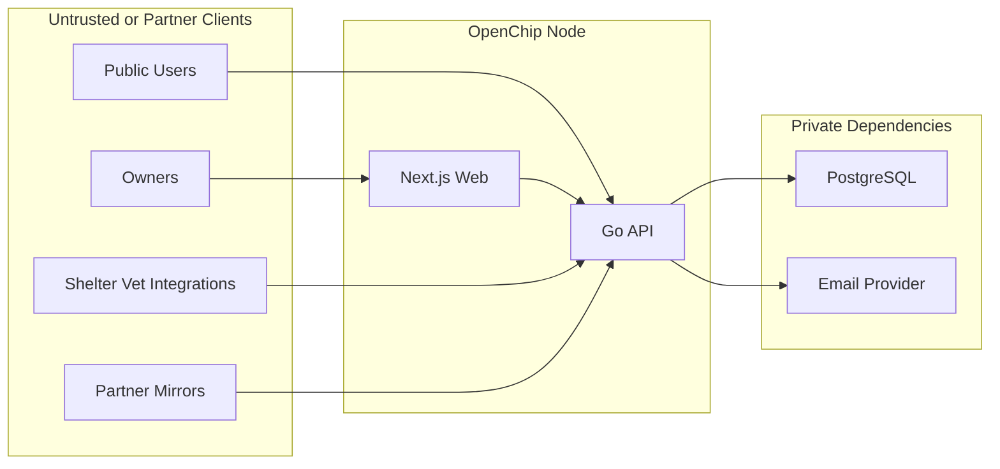

# OpenChip Threat Model

## Executive summary

OpenChip's highest-risk themes are integrity compromise of ownership state by a trusted-but-fallible single operator, credential misuse in node-local auth and partner API-key workflows, and accidental or downstream disclosure of private owner contact and lookup metadata during the current hybrid migration. The most security-critical areas are the Go API handlers and store methods that govern transfers, disputes, exports, and authentication, especially [`api/internal/app/server.go`](/Users/jlsegb/Desktop/openchip/api/internal/app/server.go) and [`api/internal/store/store.go`](/Users/jlsegb/Desktop/openchip/api/internal/store/store.go), because they bridge internet or partner inputs into integrity-critical database writes and public federation outputs.

## Scope and assumptions

In scope:

- Runtime code in [`api/`](/Users/jlsegb/Desktop/openchip/api), [`web/`](/Users/jlsegb/Desktop/openchip/web), [`db/migrations/`](/Users/jlsegb/Desktop/openchip/db/migrations), and architecture/API docs that describe intended behavior, especially [`README.md`](/Users/jlsegb/Desktop/openchip/README.md), [`docs/openapi.yaml`](/Users/jlsegb/Desktop/openchip/docs/openapi.yaml), [`docs/architecture/federation.md`](/Users/jlsegb/Desktop/openchip/docs/architecture/federation.md), and [`docs/architecture/data-model.md`](/Users/jlsegb/Desktop/openchip/docs/architecture/data-model.md).
- Production/runtime trust boundaries: public or partner API access, owner auth, admin auth, shelter API-key access, outbound email, and PostgreSQL persistence.

Out of scope:

- Tests, local-only developer tooling, Docker/Adminer exposure in dev, and speculative future multi-node sync beyond the published snapshot/event interfaces.
- Vulnerabilities requiring arbitrary database shell access or source-code modification by the attacker.

Assumptions:

- User-confirmed context: deployment is effectively single-tenant per operator for now; public lookup and federation exports are likely partner/internal-network-only at first; API-key extraction from shelter/vet integrations should be treated as realistic.
- Node-local auth is email magic-link plus JWT, with admin privilege derived from `ADMIN_EMAIL` rather than a distinct admin identity store; evidence anchors: `magicLink`, `verifyMagicLink`, `RequireJWT` in [`api/internal/app/server.go`](/Users/jlsegb/Desktop/openchip/api/internal/app/server.go) and [`api/internal/middleware/auth.go`](/Users/jlsegb/Desktop/openchip/api/internal/middleware/auth.go).
- Private owner contact data is intended to remain non-public, but compatibility duplication still exists in `owners.email` / `owners.phone`; evidence anchors: [`docs/architecture/data-model.md`](/Users/jlsegb/Desktop/openchip/docs/architecture/data-model.md) and `owners`, `owner_contacts` schema in [`db/migrations/000001_init.up.sql`](/Users/jlsegb/Desktop/openchip/db/migrations/000001_init.up.sql) and [`db/migrations/000003_federation_foundation.up.sql`](/Users/jlsegb/Desktop/openchip/db/migrations/000003_federation_foundation.up.sql).
- Federation exports are intended to be public-safe but not yet cryptographically verified end-to-end; evidence anchors: `nodeMetadata`, `ExportPublicSnapshot`, `ExportEventStream`, `sanitizeFederationPayload` in [`api/internal/app/server.go`](/Users/jlsegb/Desktop/openchip/api/internal/app/server.go) and [`api/internal/store/store.go`](/Users/jlsegb/Desktop/openchip/api/internal/store/store.go).

Open questions that would materially change ranking:

- Whether partner/internal endpoints will eventually become directly internet-accessible without an API gateway or VPN boundary.
- Whether shelter/vet integrations will rotate per-device or per-organization API keys and whether requests can be bound to source networks or mTLS.
- Whether admins will remain a single mailbox or move to auditable per-user operator accounts.

## System model

### Primary components

- Go API server: main runtime entrypoint, registers all HTTP routes for auth, owner CRUD, public lookup, transfers, disputes, shelter notifications, admin workflows, and federation exports; evidence anchors: `New` and handlers in [`api/internal/app/server.go`](/Users/jlsegb/Desktop/openchip/api/internal/app/server.go), `main` in [`api/cmd/server/main.go`](/Users/jlsegb/Desktop/openchip/api/cmd/server/main.go).
- PostgreSQL-backed store: persists owners, private contacts, pets, claims, disputes, transfers, lookup logs, export batches, and append-only ownership events; evidence anchors: store methods in [`api/internal/store/store.go`](/Users/jlsegb/Desktop/openchip/api/internal/store/store.go), schema in [`db/migrations/000001_init.up.sql`](/Users/jlsegb/Desktop/openchip/db/migrations/000001_init.up.sql) and [`db/migrations/000003_federation_foundation.up.sql`](/Users/jlsegb/Desktop/openchip/db/migrations/000003_federation_foundation.up.sql).
- Next.js web client: browser-based owner and public lookup flows using `fetch` with cookies included; evidence anchors: [`web/lib/api.ts`](/Users/jlsegb/Desktop/openchip/web/lib/api.ts), [`web/components/auth-form.tsx`](/Users/jlsegb/Desktop/openchip/web/components/auth-form.tsx), [`web/components/lookup-form.tsx`](/Users/jlsegb/Desktop/openchip/web/components/pet-form.tsx).
- Email service: sends magic links, transfer notifications, dispute acknowledgements, and chip-scan notifications via Resend or a stubbed logger; evidence anchors: [`api/internal/email/service.go`](/Users/jlsegb/Desktop/openchip/api/internal/email/service.go), `sendEmailAsync` in [`api/internal/app/server.go`](/Users/jlsegb/Desktop/openchip/api/internal/app/server.go).
- Federation/public export surfaces: public-safe node metadata, public snapshot export, and event-stream export intended to support mirroring and future federation; evidence anchors: [`README.md`](/Users/jlsegb/Desktop/openchip/README.md), `nodeMetadata`, `exportPublicSnapshot`, `exportEventStream` in [`api/internal/app/server.go`](/Users/jlsegb/Desktop/openchip/api/internal/app/server.go).

### Data flows and trust boundaries

- Browser or partner client -> API server
  - Data: chip IDs, owner profile data, pet metadata, auth email addresses, transfer emails, dispute descriptions, JWTs, API keys.
  - Channel: HTTP/JSON; browser flows include cookies and sometimes `Authorization` header; evidence anchors: routes in [`api/internal/app/server.go`](/Users/jlsegb/Desktop/openchip/api/internal/app/server.go), [`web/lib/api.ts`](/Users/jlsegb/Desktop/openchip/web/lib/api.ts).
  - Security guarantees: route-specific JWT auth (`RequireJWT`), static API-key auth (`RequireAPIKey`), request validation helpers, and per-process in-memory rate limiting on selected public routes; evidence anchors: [`api/internal/middleware/auth.go`](/Users/jlsegb/Desktop/openchip/api/internal/middleware/auth.go), [`api/internal/middleware/ratelimit.go`](/Users/jlsegb/Desktop/openchip/api/internal/middleware/ratelimit.go), [`api/internal/validate/validate.go`](/Users/jlsegb/Desktop/openchip/api/internal/validate/validate.go).
  - Validation/normalization: chip normalization and length checks, email syntax checks, bounded text fields, species enum checks; evidence anchors: [`api/internal/chip/normalize.go`](/Users/jlsegb/Desktop/openchip/api/internal/chip/normalize.go), [`api/internal/validate/validate.go`](/Users/jlsegb/Desktop/openchip/api/internal/validate/validate.go).

- API server -> PostgreSQL
  - Data: private owner contact data, disputes, transfer tokens, lookup IP and agent metadata, public and private projections, append-only event payloads, export payloads.
  - Channel: pgx connection over `DATABASE_URL`; evidence anchors: config in [`api/internal/config/config.go`](/Users/jlsegb/Desktop/openchip/api/internal/config/config.go), store methods in [`api/internal/store/store.go`](/Users/jlsegb/Desktop/openchip/api/internal/store/store.go).
  - Security guarantees: parameterized queries and transactional updates in selected flows such as `ConsumeMagicLink` and `ApproveTransfer`; evidence anchors: [`api/internal/store/store.go`](/Users/jlsegb/Desktop/openchip/api/internal/store/store.go).
  - Validation/normalization: application-layer validation before writes, but no DB-level field encryption and no row-level security; evidence anchors: schema in [`db/migrations/000001_init.up.sql`](/Users/jlsegb/Desktop/openchip/db/migrations/000001_init.up.sql), [`db/migrations/000003_federation_foundation.up.sql`](/Users/jlsegb/Desktop/openchip/db/migrations/000003_federation_foundation.up.sql).

- API server -> Email provider
  - Data: magic-link URLs, transfer notices, lookup-triggered scan alerts, dispute acknowledgements.
  - Channel: HTTPS via Resend client when enabled; evidence anchors: [`api/internal/email/service.go`](/Users/jlsegb/Desktop/openchip/api/internal/email/service.go).
  - Security guarantees: none beyond provider trust and transport; emails themselves are bearer-style delivery channels for auth and transfer awareness.
  - Validation/normalization: recipient emails validated before most sends in handlers; evidence anchors: `magicLink`, `initiateTransfer`, `createDispute` in [`api/internal/app/server.go`](/Users/jlsegb/Desktop/openchip/api/internal/app/server.go).

- API server -> Partner or future mirror consumers
  - Data: node metadata, public registration metadata, sanitized event payloads.
  - Channel: HTTP/JSON export endpoints; evidence anchors: `/.well-known/openchip-node`, `/api/v1/federation/snapshot`, `/api/v1/federation/events` in [`api/internal/app/server.go`](/Users/jlsegb/Desktop/openchip/api/internal/app/server.go).
  - Security guarantees: currently no auth on export routes in code, but user states deployment likely restricts these at the network boundary initially; event export omits some private fields via `sanitizeFederationPayload`.
  - Validation/normalization: `since` must be RFC3339; export payloads are sanitized by event type before publication; evidence anchors: `exportEventStream`, `sanitizeFederationPayload` in [`api/internal/app/server.go`](/Users/jlsegb/Desktop/openchip/api/internal/app/server.go) and [`api/internal/store/store.go`](/Users/jlsegb/Desktop/openchip/api/internal/store/store.go).

#### Diagram

## Assets and security objectives

| Asset | Why it matters | Security objective (C/I/A) |
| --- | --- | --- |
| `owner_contacts` email and phone data | Direct owner PII exposure creates privacy and safety risk for owners and pets; evidence anchors: [`docs/architecture/data-model.md`](/Users/jlsegb/Desktop/openchip/docs/architecture/data-model.md), [`db/migrations/000003_federation_foundation.up.sql`](/Users/jlsegb/Desktop/openchip/db/migrations/000003_federation_foundation.up.sql) | C |
| Legacy `owners.email` / `owners.phone` copy | Migration-era duplication expands the blast radius for accidental leaks and query mistakes; evidence anchors: [`docs/architecture/data-model.md`](/Users/jlsegb/Desktop/openchip/docs/architecture/data-model.md), [`db/migrations/000001_init.up.sql`](/Users/jlsegb/Desktop/openchip/db/migrations/000001_init.up.sql) | C |
| Ownership state in `pets`, `registration_claims`, `transfers`, `disputes` | Integrity determines who can manage a pet and whether reunification signals are trustworthy; evidence anchors: [`db/migrations/000001_init.up.sql`](/Users/jlsegb/Desktop/openchip/db/migrations/000001_init.up.sql), [`db/migrations/000003_federation_foundation.up.sql`](/Users/jlsegb/Desktop/openchip/db/migrations/000003_federation_foundation.up.sql) | I |
| `ownership_events` and export batches | They are the audit and future federation substrate; tampering undermines survivability and mirror trust; evidence anchors: [`docs/architecture/federation.md`](/Users/jlsegb/Desktop/openchip/docs/architecture/federation.md), `appendEvent` in [`api/internal/store/store.go`](/Users/jlsegb/Desktop/openchip/api/internal/store/store.go) | I |
| Magic-link and transfer tokens | Bearer-style tokens can grant account access or ownership transfer if stolen or replayed; evidence anchors: `CreateMagicLink`, `ConsumeMagicLink`, `CreateTransfer`, `ApproveTransfer` in [`api/internal/store/store.go`](/Users/jlsegb/Desktop/openchip/api/internal/store/store.go) | C/I |
| Shelter API keys | Extracted partner credentials can drive bulk owner notifications and privileged lookup context; evidence anchors: `RequireAPIKey` in [`api/internal/middleware/auth.go`](/Users/jlsegb/Desktop/openchip/api/internal/middleware/auth.go), config parsing in [`api/internal/config/config.go`](/Users/jlsegb/Desktop/openchip/api/internal/config/config.go) | C/I |
| Lookup logs with IP and agent | They are sensitive metadata about who searched for a pet and from where; evidence anchors: `LogLookup`, `LookupHistoryForPet`, `ExportOwnerData` in [`api/internal/store/store.go`](/Users/jlsegb/Desktop/openchip/api/internal/store/store.go) | C |
| Lookup/contact availability | Recovery value depends on prompt access to lookup, notifications, and owner/admin flows; evidence anchors: route map and rate limiters in [`api/internal/app/server.go`](/Users/jlsegb/Desktop/openchip/api/internal/app/server.go) and [`api/internal/middleware/ratelimit.go`](/Users/jlsegb/Desktop/openchip/api/internal/middleware/ratelimit.go) | A |

## Attacker model

### Capabilities

- Anonymous or semi-trusted partner users can send crafted HTTP requests to public or partner-exposed endpoints, including lookup, contact, dispute, and possibly export routes depending on deployment boundary.
- Attackers can control typical web input fields and JSON bodies and can automate requests from many IPs, weakening per-process or per-IP in-memory rate limits.
- Attackers may obtain a valid shelter/vet API key from a shared device, logs, reverse engineering, or staff compromise and use it server-to-server.
- Attackers may compromise or control an email inbox for a target owner/admin, making magic-link or transfer notification flows security-relevant.
- A malicious or compromised node operator is in scope for integrity threats because the repo currently trusts local DB and admin authority while federation signatures remain placeholder-only; evidence anchors: [`docs/architecture/federation.md`](/Users/jlsegb/Desktop/openchip/docs/architecture/federation.md), `signature_strategy` in `nodeMetadata` in [`api/internal/app/server.go`](/Users/jlsegb/Desktop/openchip/api/internal/app/server.go).

### Non-capabilities

- This model does not assume memory-corruption exploitation in Go libraries or database superuser access by a remote attacker.
- This model does not assume cross-node consensus or cryptographic verification exists today, so threats requiring bypass of those controls are not relevant yet.
- Because lookup and federation exports are expected to be partner/internal-first, opportunistic internet-scale scraping is less likely at launch than credential misuse or operator-side integrity compromise, though it becomes more important if those routes later become public.

## Entry points and attack surfaces

| Surface | How reached | Trust boundary | Notes | Evidence (repo path / symbol) |
| --- | --- | --- | --- | --- |
| `POST /api/v1/auth/magic-link` | Browser or API client | Untrusted user -> API | Creates owner records and magic-link tokens; email enumeration is dampened by generic response and per-email limiter, but still a sensitive auth trigger | [`api/internal/app/server.go`](/Users/jlsegb/Desktop/openchip/api/internal/app/server.go) `magicLink` |
| `POST /api/v1/auth/verify` | Browser with emailed token | Email-controlled user -> API | Consumes one-time magic-link token and issues JWT plus session cookie | [`api/internal/app/server.go`](/Users/jlsegb/Desktop/openchip/api/internal/app/server.go) `verifyMagicLink` |
| Authenticated owner routes under `/api/v1/auth/me`, `/pets`, `/export`, `/account` | JWT cookie or bearer token | Authenticated owner -> API | Handles private profile and pet data plus export of lookup metadata | [`api/internal/app/server.go`](/Users/jlsegb/Desktop/openchip/api/internal/app/server.go) `me`, `updateMe`, `createPet`, `exportData`, `deleteAccount` |
| `POST /api/v1/lookup/{chip_id}/contact` | Public or partner caller | Untrusted caller -> API | Causes owner notifications without caller auth, limited only by IP-based in-memory rate limiting | [`api/internal/app/server.go`](/Users/jlsegb/Desktop/openchip/api/internal/app/server.go) `contactOwner` |
| `POST /api/v1/shelter/found` | X-API-Key client | Partner system -> API | Returns owner name and triggers owner notifications; key theft is a realistic concern | [`api/internal/app/server.go`](/Users/jlsegb/Desktop/openchip/api/internal/app/server.go) `shelterFound`, [`api/internal/middleware/auth.go`](/Users/jlsegb/Desktop/openchip/api/internal/middleware/auth.go) `RequireAPIKey` |
| `POST /api/v1/transfers/{token}/confirm` and `/reject` | Token holder | Untrusted token holder -> API | Transfer confirmation is a bearer-token action with no additional auth binding | [`api/internal/app/server.go`](/Users/jlsegb/Desktop/openchip/api/internal/app/server.go) `confirmTransfer`, `rejectTransfer` |
| `POST /api/v1/disputes` and admin dispute endpoints | Public submitter or admin JWT | Untrusted/reporter or admin -> API | Public dispute input can affect claim status; admin updates restore or alter state | [`api/internal/app/server.go`](/Users/jlsegb/Desktop/openchip/api/internal/app/server.go) `createDispute`, `adminUpdateDispute` |
| `GET /api/v1/federation/snapshot` and `/events` | Partner or mirror consumer | External consumer -> API | Public-safe export surfaces with no route auth in code; deployment boundary matters | [`api/internal/app/server.go`](/Users/jlsegb/Desktop/openchip/api/internal/app/server.go) `exportPublicSnapshot`, `exportEventStream` |
| Cookie/session handling | Browser requests | Browser -> API | Session cookie is `HttpOnly` and `SameSite=Lax`, secure only if `BASE_URL` is HTTPS | [`api/internal/app/server.go`](/Users/jlsegb/Desktop/openchip/api/internal/app/server.go) `setSessionCookie` |
| Logging and lookup metadata sinks | Normal request processing | API -> logs / DB | Request logs omit body, but email send failures and lookup exports include owner/chip identifiers and IP metadata | [`api/internal/middleware/logging.go`](/Users/jlsegb/Desktop/openchip/api/internal/middleware/logging.go), [`api/internal/store/store.go`](/Users/jlsegb/Desktop/openchip/api/internal/store/store.go) `LogLookup`, `ExportOwnerData` |

## Top abuse paths

1. Attacker obtains a shelter API key from a shared device or integration, calls `POST /api/v1/shelter/found` with valid chip IDs, triggers repeated owner notifications, and uses returned owner names plus partner context to impersonate legitimate recovery staff and manipulate reunification.
2. Attacker compromises the configured admin mailbox, requests a magic link, verifies it, and uses admin dispute endpoints to reopen or resolve disputes and change the practical state of contested claims while appearing as a legitimate operator action.
3. Attacker intercepts or steals a transfer token from email, browser history, logs, or screenshots, posts to `/api/v1/transfers/{token}/confirm`, and causes an ownership transfer because confirmation is a bearer-only action not bound to a logged-in recipient account.
4. Malicious or compromised node operator alters database rows or application behavior, then emits snapshots and event streams that appear valid enough for downstream mirrors because signatures are placeholder-only and verification is not enforced.
5. Authenticated owner exports their data or views lookup history, and residual recovery metadata is later leaked through client-side handling, support workflows, or future less-trusted delegates even though default exports now redact requester IP and user-agent fields.
6. Attacker automates `lookup/{chip_id}/contact` or `auth/magic-link` across many IPs or through a botnet, bypassing single-process in-memory rate limits to spam owners, degrade availability, or create operational noise that masks targeted abuse.
7. Public reporter submits a fraudulent dispute for a real chip, creating operational review load and potential confusion even though claims are now only marked `disputed` once an operator explicitly moves the case into review.

## Threat model table

| Threat ID | Threat source | Prerequisites | Threat action | Impact | Impacted assets | Existing controls (evidence) | Gaps | Recommended mitigations | Detection ideas | Likelihood | Impact severity | Priority |
| --- | --- | --- | --- | --- | --- | --- | --- | --- | --- | --- | --- | --- |
| TM-001 | Compromised partner, insider, or attacker with extracted API key | Attacker obtains any valid `X-API-Key` from `SHELTER_API_KEYS` and can reach partner endpoint | Abuse `POST /api/v1/shelter/found` to enumerate valid chips and trigger owner notifications while leveraging partner context for social engineering | Repeated notifications, trust erosion, targeted harassment, and possible fraudulent transfer/dispute follow-on | Shelter API keys, mediated contact workflow, availability of owner notifications | Static API-key check, bounded text validation, and shelter response minimization to pet metadata plus mediated contact fields; evidence: `RequireAPIKey` in [`api/internal/middleware/auth.go`](/Users/jlsegb/Desktop/openchip/api/internal/middleware/auth.go), `shelterFound` in [`api/internal/app/server.go`](/Users/jlsegb/Desktop/openchip/api/internal/app/server.go) | Keys are long-lived shared secrets, not source-bound, role-scoped, or rate-limited separately | Move to per-client keys with rotation, last-used tracking, and revocation; add per-key and per-chip rate limits; restrict by source network or mTLS | Alert on per-key spikes, new source IPs, high miss/found ratios, and bursts of owner notifications | High | Medium | high |
| TM-002 | Attacker with compromised admin inbox or mail access | Attacker can receive magic link for `ADMIN_EMAIL` and reach verify endpoint | Log in as admin and manipulate dispute workflow and stats endpoints | Unauthorized claim state changes and operator-level integrity compromise | Ownership state, disputes, audit trust | Magic links are single-use and expire; JWT cookies are `HttpOnly`; evidence: `CreateMagicLink`, `ConsumeMagicLink`, `setSessionCookie`, `RequireJWT(..., true)` in [`api/internal/store/store.go`](/Users/jlsegb/Desktop/openchip/api/internal/store/store.go) and [`api/internal/app/server.go`](/Users/jlsegb/Desktop/openchip/api/internal/app/server.go) | Admin identity is a mailbox string comparison, with no MFA, separate admin store, or step-up approval for dispute actions | Introduce explicit operator accounts with auditable identities, MFA or WebAuthn, and step-up confirmation for dispute resolution; require admin-only auth path separate from owner sign-in | Alert on admin logins, new device/IP patterns, dispute resolution bursts, and mailbox-based role changes | Medium | High | high |
| TM-003 | Email attacker, recipient mailbox compromise, or token leak | Attacker gets transfer token from email/link handling and token is still pending | Call transfer confirm endpoint as bearer-only action | Ownership transferred without recipient identity proof beyond token possession | Transfer integrity, registration claims, owner trust | Tokens are random, expire after 48h, are now hashed at rest, and approval is transactional; evidence: `CreateTransfer`, `ApproveTransfer`, `ResolveTransfer` in [`api/internal/store/store.go`](/Users/jlsegb/Desktop/openchip/api/internal/store/store.go), `confirmTransfer` in [`api/internal/app/server.go`](/Users/jlsegb/Desktop/openchip/api/internal/app/server.go) | Token is still exposed in URL path and not bound to authenticated recipient or secondary confirmation | Bind confirmation to logged-in intended owner email, require explicit review page plus re-auth, and consider short-lived signed action tokens rather than URL bearer tokens alone | Alert on confirmations from IPs or geos that never requested the transfer, and on rapid initiation-confirm pairs | Medium | High | high |
| TM-004 | Malicious operator, DB compromise, or downstream mirror consuming forged exports | Attacker can alter DB/application on a node or publish manipulated exports | Tamper with events or projections and emit convincing snapshots/event streams without enforceable signatures | Downstream mirrors trust false ownership history, undermining federation and survivability goals | Ownership events, public snapshots, node trust | Event hash chaining exists and exported event payloads are sanitized; evidence: `appendEvent`, `ExportEventStream`, `publicFederationEvent` in [`api/internal/store/store.go`](/Users/jlsegb/Desktop/openchip/api/internal/store/store.go), federation docs in [`docs/architecture/federation.md`](/Users/jlsegb/Desktop/openchip/docs/architecture/federation.md) | `signature` is `NULL`, actor keys are placeholders, and nothing verifies exported provenance against independent trust anchors | Implement real signing keys, publish trust roots, verify signatures on import, and protect export signing material separately from app DB credentials | Alert on event hash discontinuities, export payload hash mismatches, key rotation anomalies, and snapshot diffs outside expected change windows | Medium | High | high |
| TM-005 | Fraudulent reporter or nuisance attacker | Attacker knows a real chip ID and can submit a dispute | File false dispute that consumes operator review time and can move claims into `disputed` once an operator marks the case `reviewing` | Operational disruption, owner confusion, and reviewer workload | Registration claims, dispute workflow availability | Input validation exists, public dispute creation no longer auto-disputes claims, and admin-only review/resolution controls claim-state changes; evidence: `createDispute`, `adminUpdateDispute` in [`api/internal/app/server.go`](/Users/jlsegb/Desktop/openchip/api/internal/app/server.go), `CreateDispute`, `UpdateDispute` in [`api/internal/store/store.go`](/Users/jlsegb/Desktop/openchip/api/internal/store/store.go) | No proof-of-possession, supporting evidence requirement, or throttling beyond IP limit on public dispute submission | Require corroborating details or case workflow, add per-chip and per-reporter abuse controls, and consider explicit `reported` vs `reviewing` dispute states in the data model | Alert on repeated disputes for same chip, same reporter patterns, and high unresolved dispute queues | Medium | Medium | medium |
| TM-006 | Botnet, scripted abuser, or partner with broad network reach | Attacker can distribute requests across IPs or instances | Evade in-memory per-process rate limits on lookup/contact/auth endpoints to spam owners or degrade service | Availability loss, notification abuse, and noisy operational conditions that hide targeted actions | Lookup/contact availability, owner trust, email channel | Route-specific in-memory rate limits and per-email auth limiter; evidence: `publicIPLimit`, `allowAuthEmail` in [`api/internal/app/server.go`](/Users/jlsegb/Desktop/openchip/api/internal/app/server.go), [`api/internal/middleware/ratelimit.go`](/Users/jlsegb/Desktop/openchip/api/internal/middleware/ratelimit.go) | Limits are not shared across instances, easy to bypass with distributed sources, and not tied to chip/account/key dimensions | Move rate limiting to shared storage or gateway, add chip- and recipient-based quotas, CAPTCHA or proof-of-work for public contact, and backpressure on email sends | Monitor rate-limit misses, email send volume, per-chip contact spikes, and auth request fan-out across source IPs | Medium | Medium | medium |
| TM-007 | Support delegate, future frontend feature, or accidental disclosure after owner export | Attacker gains access to exported JSON or screens where it is handled | Use lookup history and timestamps to profile recovery activity even though requester IP and user-agent are redacted by default | Privacy harm and chilling effect on reporting or lookups | Lookup logs, owner privacy | Export is authenticated and owner-scoped, and default export now redacts requester IP and agent metadata; evidence: `RequireJWT`, `exportData`, `ExportOwnerData` in [`api/internal/middleware/auth.go`](/Users/jlsegb/Desktop/openchip/api/internal/middleware/auth.go), [`api/internal/app/server.go`](/Users/jlsegb/Desktop/openchip/api/internal/app/server.go), [`api/internal/store/store.go`](/Users/jlsegb/Desktop/openchip/api/internal/store/store.go) | Export still includes lookup history and timing data, with no separate detailed/admin-only export tier | Make detailed lookup metadata an explicit admin or casework export, and document lookup-history sensitivity in the UI | Track export volume, support access to exported files, and unusual repeated download behavior | Low | Medium | low |
| TM-008 | Future route exposure misconfiguration or over-trusting partner network | Snapshot/event endpoints become more broadly reachable than intended | Bulk consume public snapshot/event exports to enumerate registration metadata or monitor operational activity | Metadata exposure and easier social engineering against owners or operators | Public registration metadata, operational privacy | Payload sanitization omits raw contact fields; evidence: `ExportPublicSnapshot`, `sanitizeFederationPayload` in [`api/internal/store/store.go`](/Users/jlsegb/Desktop/openchip/api/internal/store/store.go) | No code-level auth on export routes; partner/internal restriction depends on deployment not app enforcement | Add optional auth or signed mirror credentials, response watermarking, and deployment checks that fail closed when public exposure is unintended | Monitor export consumers, large download patterns, and route exposure changes in deployment configs | Low | Medium | low |

## Criticality calibration

For this repo and current deployment model:

- `critical` means compromise of private owner contact at scale, node-wide unauthorized admin control, or successful publication of forged federation history that downstream nodes would trust as authoritative. Example targets would include raw owner PII exposure from private tables, total admin auth bypass, or signed export forgery once signatures exist.
- `high` means realistic attacks that can alter ownership/dispute state, misuse privileged partner integrations, or meaningfully undermine trust in recovery workflows without needing deep infrastructure compromise. Examples here are extracted shelter API-key abuse, admin mailbox takeover, transfer-token misuse, and operator-side export tampering in the current unsigned model.
- `medium` means attacks that disrupt service, create targeted privacy harm, or allow operational abuse but do not directly give broad unauthorized control over registry truth. Examples here are fraudulent disputes that auto-mark claims disputed, distributed contact/auth spam that bypasses in-memory rate limits, and overexposed lookup metadata in owner exports.
- `low` means narrower metadata leakage or abuse that depends on later deployment changes or weak assumptions. Examples here are partner-only export scraping while routes remain network-restricted, or low-sensitivity public metadata correlation from already-sanitized snapshot fields.

## Focus paths for security review

| Path | Why it matters | Related Threat IDs |
| --- | --- | --- |
| [`/Users/jlsegb/Desktop/openchip/api/internal/app/server.go`](/Users/jlsegb/Desktop/openchip/api/internal/app/server.go) | Central route map and handler logic for auth, transfer, dispute, export, and notification paths | TM-001, TM-002, TM-003, TM-005, TM-006, TM-008 |
| [`/Users/jlsegb/Desktop/openchip/api/internal/store/store.go`](/Users/jlsegb/Desktop/openchip/api/internal/store/store.go) | Integrity-critical persistence logic, token handling, event writing, export sanitization, and lookup log exposure | TM-002, TM-003, TM-004, TM-005, TM-007, TM-008 |
| [`/Users/jlsegb/Desktop/openchip/api/internal/middleware/auth.go`](/Users/jlsegb/Desktop/openchip/api/internal/middleware/auth.go) | Defines JWT and API-key trust boundaries with minimal role model | TM-001, TM-002, TM-007 |
| [`/Users/jlsegb/Desktop/openchip/api/internal/middleware/ratelimit.go`](/Users/jlsegb/Desktop/openchip/api/internal/middleware/ratelimit.go) | Current anti-abuse control is single-process and easy to outscale | TM-001, TM-006 |
| [`/Users/jlsegb/Desktop/openchip/api/internal/config/config.go`](/Users/jlsegb/Desktop/openchip/api/internal/config/config.go) | Credential and trust-boundary configuration for admin email, JWT secret, proxy trust, and shelter keys | TM-001, TM-002, TM-006, TM-008 |
| [`/Users/jlsegb/Desktop/openchip/api/internal/email/service.go`](/Users/jlsegb/Desktop/openchip/api/internal/email/service.go) | Email is a security delivery channel for auth, transfer, and lookup alerts | TM-002, TM-003, TM-006 |
| [`/Users/jlsegb/Desktop/openchip/db/migrations/000001_init.up.sql`](/Users/jlsegb/Desktop/openchip/db/migrations/000001_init.up.sql) | Legacy schema still stores duplicated contact fields and the original transfer-token column definition even though application code now hashes tokens before insert | TM-003, TM-007 |
| [`/Users/jlsegb/Desktop/openchip/db/migrations/000003_federation_foundation.up.sql`](/Users/jlsegb/Desktop/openchip/db/migrations/000003_federation_foundation.up.sql) | Federation-era tables define event, actor key, export, and private/public data split assumptions | TM-004, TM-007, TM-008 |
| [`/Users/jlsegb/Desktop/openchip/docs/architecture/data-model.md`](/Users/jlsegb/Desktop/openchip/docs/architecture/data-model.md) | Documents migration-era duplication and public/private boundary expectations that still shape risk | TM-004, TM-007 |
| [`/Users/jlsegb/Desktop/openchip/docs/architecture/federation.md`](/Users/jlsegb/Desktop/openchip/docs/architecture/federation.md) | Explains current single-node trust concentration and missing signature enforcement | TM-004, TM-008 |
| [`/Users/jlsegb/Desktop/openchip/web/lib/api.ts`](/Users/jlsegb/Desktop/openchip/web/lib/api.ts) | Browser fetch behavior defines cookie exposure and how private exports are retrieved | TM-002, TM-007 |
| [`/Users/jlsegb/Desktop/openchip/web/components/pet-form.tsx`](/Users/jlsegb/Desktop/openchip/web/components/pet-form.tsx) | Exposes lookup history to owners and drives transfer actions from the browser | TM-003, TM-007 |

## Quality check

- All discovered runtime entry points were covered: public lookup/contact, auth, owner CRUD, transfer, disputes, shelter API, admin routes, and federation exports.
- Each major trust boundary appears in at least one threat: external/partner caller -> API, API -> DB, API -> email, and API -> mirror/export consumer.
- Runtime behavior was separated from tests/dev tooling; Docker/Adminer and tests were excluded from risk ranking.
- User clarifications were incorporated: single-tenant-per-operator, partner/internal-first exposure for lookup and export, and realistic API-key extraction.
- Assumptions and open questions are explicit, especially around future internet exposure, admin identity design, and partner credential hardening.
